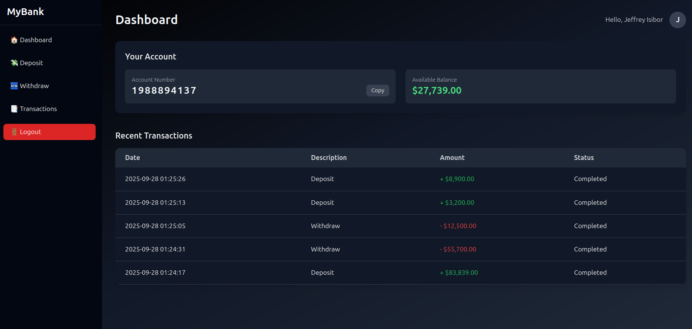
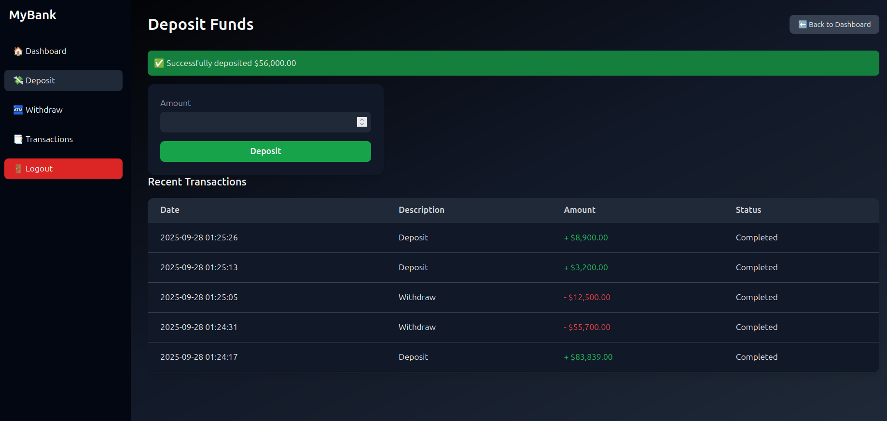
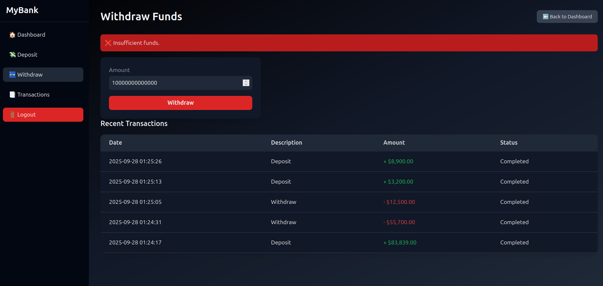
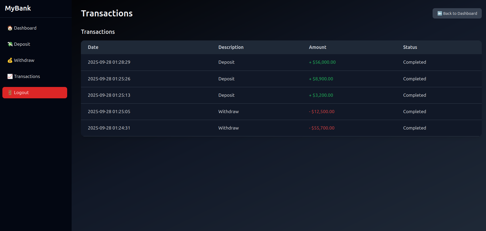

# 💳 OOP Auth Banking Sim

A simple **banking simulator** built with **PHP (OOP)**, featuring authentication, account creation with auto-generated numbers, deposits, withdrawals, and transaction history.

## 🚀 Features

* User signup/login system (OOP-based)
* Auto-generated account numbers
* Dashboard with account balance + copy-to-clipboard button
* Deposit & Withdraw forms with real DB updates
* Transactions table (saves and shows last 5 transactions)
* Toast notification when copying account number


## 🖼 Screenshots

1. Login Page  
   

2. Dashboard (Balance + Account Number)  
   

3. Deposit Page  
   

4. Withdraw Page  
   

5. Recent Transactions Table  
   

## 🗄 Database Setup

1. Create a new MySQL database (e.g., `banking_sim`).
2. Import the SQL file from `/database/banking_sim.sql`.
3. Update your DB credentials in `config/config.php`.

## ▶️ How to Run

1. Clone this repo
2. Import the DB (see above)
3. Start a PHP server:

   ```bash
   php -S localhost:8000 -t public
   ```
4. Open [http://localhost:8000](http://localhost:8000) in your browser

Enjoy banking like a pro 🚀

---

### 📝 Commit Summary (Last Feature)

**Summary:** Added deposit/withdraw UI, DB transactions, and recent history display.

**Description:**

* Built simple Tailwind UI for deposit and withdraw pages
* Linked back to dashboard via sidebar navigation
* Implemented saving of deposits/withdrawals into transactions table
* Displayed last 5 transactions on dashboard
* Ensured account balance updates in real-time
